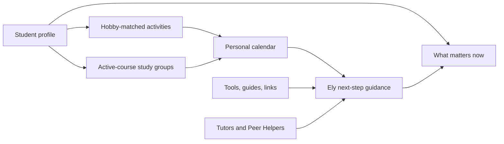

# Elysium Complete Project Handoff

> **Purpose:** Give this entire file to a new Codex/ChatGPT thread before asking it to work on Elysium.
>
> **Last verified:** June 15, 2026, Asia/Jerusalem.
>
> **Repository path:** `C:\Users\ammar\OneDrive\Desktop\Dalili`

## 1. Read This First

Elysium is a real, deployed Base44 application and a private GitHub project. It began as `Dalili / دليلي`, an Arabic-first hackathon idea for Arab students entering Israeli higher education. The product later expanded to serve all students while retaining first-class English, Hebrew, and Arabic support.

The current product is a personalized, trilingual student hub that connects:

- Social activities.
- Course-based study groups and study marathons.
- Private tutors.
- Voluntary Peer Helpers.
- A personal calendar.
- GPA, grade-planning, flashcard, guide, and official-link tools.
- Ely, an AI assistant that helps the student decide what to do next.

The product is being prepared for the Hub02 x BGU Hackathon scheduled for **June 17-22, 2026**. BGU is the complete launch campus, but the data model is intended to support multiple universities.

### One-sentence product definition

> Elysium is a personalized, trilingual student hub for planning university life, meeting people, studying together, finding academic help, and knowing what to do next.

### Core product rule

Elysium must remain a **one-stop social and study companion**. Do not reduce it to a generic planner, an AI chatbot, a resource library, or a tutor marketplace. The value is that all modules share one student context.

## 2. Mandatory Repository Rule

Read [`AGENTS.md`](AGENTS.md) before editing anything.

The most important rule is:

- If Ammar provides an image, logo, file, document, dataset, design, or other project asset, use that exact supplied asset.
- Do not generate, redraw, reinterpret, replace, or substitute a supplied asset without Ammar's explicit approval.
- If an alternative may be better, explain it and wait for approval before creating or using it.
- Preserve original supplied files. Copy them into app-owned folders only when required for build or deployment.

This rule was added after generated logo assets were used without permission. Treat it as non-negotiable.

## 3. Source-of-Truth Order

When files disagree, use this order:

1. `AGENTS.md` for repository behavior and supplied-asset rules.
2. The actual current code and Base44 schemas on the active branch.
3. This `PROJECT_HANDOFF.md` file for current product and workflow context.
4. Root `README.md` for the public-facing overview.
5. Current product/design documents under `docs/`.
6. Older planning, audit, prompt, and backlog documents as historical context only.

Several older documents still mention superseded decisions such as:

- User-facing “study sessions” instead of “study groups.”
- Persistent study-group entities and pages.
- Tutor booking requests or in-app conversations.
- Faculty and residence/commute questions in onboarding.
- More team members than Ammar and Marwan.

The current implementation decisions in this file take precedence over those older descriptions.

## 4. Where Everything Lives

### Main repository

```text
C:\Users\ammar\OneDrive\Desktop\Dalili
```

The folder name remains `Dalili` for historical reasons. The product and GitHub repository are named **Elysium**.

### Deployable application

```text
C:\Users\ammar\OneDrive\Desktop\Dalili\app
```

All React code, Base44 configuration, schemas, tests, and deployment output live under `app/`.

### Product and research documentation

```text
C:\Users\ammar\OneDrive\Desktop\Dalili\docs
```

### GitHub

- Repository: `https://github.com/ammar31mawassi/Elysium.git`
- Visibility: private.
- Default branch: `main`.
- Current working branch: `codex/elysium-product-flow-fixes`.
- Implementation baseline commit: `2d0c7d63d37b6d30641ca562f354b1a2e7d68791`.
- Baseline subject: `Complete Elysium student workflows`.
- This handoff file may be committed later on the same branch, so future branch HEADs should be descendants of that baseline rather than exactly equal to it.
- No open pull request existed when this file was created.
- Suggested PR URL: `https://github.com/ammar31mawassi/Elysium/pull/new/codex/elysium-product-flow-fixes`

### Important Git warning

`main` is currently behind the deployed product. `main` points to commit `9378f51`, while the live feature work is on `codex/elysium-product-flow-fixes` at `2d0c7d6`.

Do **not** start new product work from `main` until the feature branch is merged. Either:

1. Continue from `codex/elysium-product-flow-fixes`, or
2. Create the next feature branch from that branch.

### Live Base44 application

- Live site: `https://elysium-nexus-flow.base44.app/`
- Base44 app ID: `6a2ae3a92ace0dad0f92f1a6`
- Base44 editor: `https://app.base44.com/apps/6a2ae3a92ace0dad0f92f1a6/editor/workspace/overview`

The live frontend is hosted by Base44. Base44 also provides authentication, entities, AI Agents, AI integration, and backend access controls.

### Historical read-only prototypes

These were used for research and comparison. Do not edit or copy code from them unless Ammar explicitly changes that rule:

- `C:\Users\ammar\IdeaProjects\DaliliApp`
- `C:\Users\ammar\OneDrive\Desktop\myprojects\vibecoding\dalili_with_lovable`
- `C:\Users\ammar\OneDrive\Desktop\myprojects\vibecoding\trying_with_cursor`
- Lovable reference: `https://daliliapp.lovable.app/`

The Lovable version influenced the navigation structure, but the current local Base44 project is the application source of truth.

## 5. Current Git Worktree State

At the time of this handoff, the tracked product work is committed and pushed. The following root files are intentionally untracked user assets/source materials:

- `ELYSIUM — Project Plan & Roadmap (Hub02 x BGU Hackathon 2026).pdf`
- `Logo_DarkTheme.png`
- `Logo_DarkTheme_NoBG.png`
- `Logo_LightTheme_Teal.png`
- `Logo_LightTheme_Teal_NoBG.png`
- `high-resolution-color-logo.png`
- Root `package-lock.json`

Do not delete, replace, or automatically stage these files. Avoid `git add .`. Stage exact intended paths.

The authoritative npm lockfile is `app/package-lock.json`. The tiny root `package-lock.json` is unrelated to the application and should not be used for app installs.

`Visily-Export_10-06-2025_07-54.pdf` is a tracked historical visual reference.

## 6. Product History

### Stage 1: Dalili research

The first concept was an Arabic-first campus guide for Arab students entering Israeli higher education. Research focused on:

- Language transition between Arabic daily life, Hebrew administration, and English academic terminology.
- Academic, physical, social, and cultural disorientation.
- First-year persistence risk.
- Financial and digital strain.
- Hidden university processes and fragmented support.

The research remains useful even though Elysium now serves all students. It prevents the product from flattening unequal student experiences into generic personalization.

Key documents:

- `docs/01-research/arab-student-struggles.md`
- `docs/01-research/multilingual-student-needs.md`
- `docs/01-research/prototype-audit.md`

### Stage 2: Expanded audience and renaming

The audience expanded from Arab students to all students. English, Hebrew, and Arabic remained first-class languages. The name changed from Dalili to Elysium so one language community would not feel like a guest in another community's product.

Historical naming work:

- `docs/02-product/naming-directions.md`
- `docs/02-product/dalili-idea.md`

### Stage 3: Hackathon positioning

The Hub02 x BGU Hackathon offers additional value for a Base44-built product. Elysium was therefore implemented as a Base44 app, not merely deployed as a static site on Base44 hosting.

The hackathon strategy is to prove a connected student day rather than give judges a tour of many disconnected screens.

### Stage 4: Base44 and local workflow

Early changes were attempted through Base44's conversational builder. It did not consistently follow detailed product requirements. The workflow changed to:

1. Keep the deployable source locally under `app/`.
2. Edit with Codex locally.
3. Validate with tests, ESLint, TypeScript, and a production build.
4. Push schemas and Ely's Agent definition with the Base44 CLI when they change.
5. Deploy the built frontend to the linked Base44 app.
6. Verify the live application in the in-app browser.
7. Commit and push the Git feature branch.

The Base44 editor is useful for observing the linked project, but it is not the preferred source-editing workflow.

## 7. Product Roles

### Student

- Completes onboarding.
- Maintains profile, courses, and hobbies.
- Creates and joins social activities.
- Creates and joins scheduled study groups or marathons.
- Manages private calendar items.
- Uses student tools and guides.
- Finds tutors and Peer Helpers.
- Uses Ely.

### Private Tutor

- May also be a normal student.
- Offers paid subject teaching.
- Chooses subjects, languages, teaching mode, price range, availability, and bio.
- Must explicitly consent before a WhatsApp number is public.
- Requires approval before appearing as an active public tutor.

### Peer Helper

- May also be a normal student.
- Volunteers experience-based student help.
- Chooses topics, languages, availability, bio, and visibility.
- Is not a paid tutor and is not an official university authority.
- Must explicitly consent before a WhatsApp number is public.

### Admin

- Reviews public content and reports.
- Manages approved tutors, helpers, activities, resources, and university content.
- Must not treat private student information as public moderation data.

## 8. Current MVP Behavior

### Authentication

Available routes:

- `/login`
- `/register`
- `/forgot-password`
- `/reset-password`

Authenticated users are routed into the product. Unauthenticated users are redirected to login.

### Onboarding

Route: `/onboarding`

The current onboarding has four steps:

1. Interface language and preferred name.
2. University, academic year, and searchable field of study.
3. Optional courses plus searchable/selectable interests and hobbies.
4. Current help needs.

Current rules:

- Onboarding starts in English.
- English, Hebrew, and Arabic can be selected.
- Faculty is not requested.
- Residence, commute, or housing is not requested.
- Field of study must be selected from a structured suggestion list.
- Courses are optional and start as active when entered.
- Interests are searchable.
- A custom hobby can be added when both an English and Hebrew name are supplied.
- Theme selection is not part of onboarding; system theme is the default.

### Dashboard

Route: `/`

The dashboard provides:

- “What matters now” / next-step content.
- Upcoming calendar and joined items.
- Relevant social and study recommendations.
- Tutor and Peer Helper suggestions.
- Quick tools.
- Campus context.
- Global Create action.
- Floating Ely launcher.

The dashboard must remain useful when the student has no upcoming items. It should recommend a concrete action instead of showing only an empty calendar.

### Global Create action

The desktop header, dashboard, and mobile center action share five choices:

| Choice | Route | Visibility |
| --- | --- | --- |
| Social activity | `/social?create=1` | Public/relevant to students with the same hobby |
| Study group | `/groups?create=1` | Public/relevant to students taking the same active course |
| Homework | `/calendar?create=1&type=homework` | Private calendar item |
| Exam | `/calendar?create=1&type=exam` | Private calendar item |
| Other | `/calendar?create=1&type=other` | Private calendar item |

Localization is defined in `app/src/lib/createActions.js`.

### Social activities

Routes:

- `/social`
- `/discover?tab=social`

Students can:

- Create an activity.
- Select its related hobby/activity.
- Join, leave, or cancel.
- Use capacity limits.
- Add joined activity information to their calendar.

Discovery is personalized by profile interests. The creator and joined participants can still see their own items.

### Study groups

Routes:

- `/groups`
- `/discover?tab=sessions`

The user-facing feature is called **Study groups**. The backend entity remains `StudySession` because the product changed terminology without performing a destructive data migration.

The current feature supports dated, one-time:

- Study groups.
- Study marathons.

Rules:

- A student must have at least one active course before creating a group.
- Only active profile courses are offered in the creation form.
- Relevant groups are those for the student's active courses, plus groups they host or joined.
- Joining creates a calendar item.
- Leaving removes/updates the related calendar state.
- Hosts can cancel their group.
- Capacity is enforced.

Persistent old study-group pages were removed from the UI.

### Courses

Courses are normalized through `app/src/lib/profileCourses.js`.

Each course record can have:

- `name`
- `status`: `active` or `finished`
- Optional `grade`
- Optional `credits`

Behavior:

- Active courses appear in study-group matching and creation.
- Finished courses do not appear in study-group choices.
- Both active and finished courses remain available in GPA/grade tools.
- The legacy `courses` string array is kept synchronized with `course_records` for compatibility.
- Courses can be added, removed, or have status changed after onboarding from `/profile`.

### Hobbies and interests

Students can manage hobbies after onboarding from `/profile`.

Behavior:

- Search and select an existing interest.
- Deselect an interest.
- Add a new custom interest with required English and Hebrew names.
- Newly created interests become Base44 `Interest` records and can be selected by other students.
- Interests affect social recommendations.

### Tutors and Peer Helpers

Routes:

- `/discover?tab=tutors`
- `/discover?tab=helpers`

There is no in-app student-to-student conversation system.

Current contact flow:

1. The tutor/helper opts in and provides a WhatsApp number.
2. They explicitly enable contact consent.
3. The public card displays an “Open WhatsApp” action.
4. The action opens `https://wa.me/...` with a short prefilled introduction.

If consent is absent or no number is available, the button is disabled and says the WhatsApp number is unavailable.

Phone normalization and URL generation live in `app/src/lib/whatsapp.js`.

The old `TutorRequest` and `PeerHelpRequest` entities remain in the schema directory for migration safety, but the current UI does not use them.

### Calendar

Route: `/calendar`

The calendar contains:

- Private Homework items.
- Private Exam items.
- Private Other items.
- Joined social activities.
- Joined study groups.
- Other supported source types preserved in the schema.

Students can create, complete, reopen, and delete their own personal items.

Homework and exams can optionally reference one of the student's courses. “Other” clears the course field.

All personal calendar records are owner-scoped with Base44 RLS.

### Tools

Route: `/tools`

Working/available areas include:

- GPA calculator.
- Required-grade calculator.
- Basic flashcards.
- Helpful university links.
- Source-backed guides.
- Links to tutors and Peer Helpers.

Credible future items are displayed as Coming Soon, including:

- Tutor payments.
- Google/Outlook calendar sync.
- Push notifications.
- Moodle, Inbar, and syllabus import.
- Campus maps.
- Advanced Ely automation.

### Ely assistant

Routes and surfaces:

- Floating circular launcher using the supplied Elysium mark.
- Side drawer on desktop.
- Full-height mobile sheet.
- Full page route: `/ask`.

Ely's required answer structure is:

- **Now:** the most urgent or relevant issue.
- **Next:** one concrete step.
- **Help:** a relevant Elysium route, person, guide, or official source.

Behavior and boundaries:

- Uses the Base44 Agent named `elysium_assistant`.
- Agent conversations are intended to persist.
- The UI optimistically displays the user message and polls the conversation for a response.
- If the Agent does not respond, the UI falls back to Base44 `InvokeLLM` so the student still receives an answer.
- Fallback answers are displayed in the current UI session and are not guaranteed to be stored in the Agent conversation.
- Internal routes in answers are rendered as action buttons.
- Ely receives a compact student context including university, year, field, locale, and active/finished course status.
- Ely is read-only. It does not silently create posts, bookings, or calendar entries.
- Ely must not invent university rules, deadlines, contacts, prices, emails, or official links.
- Ely may explain concepts and build study plans.
- Ely must not complete graded assignments or facilitate academic dishonesty.
- Urgent health/safety questions should be directed to official emergency or university services.

Agent definition: `app/base44/agents/elysium_assistant.jsonc`.

### Admin

Route: `/admin`

The page is role-protected in the frontend and supports moderation/management surfaces. Base44 RLS must remain the true authorization boundary; frontend redirects alone are not sufficient security.

## 9. App Routes

| Route | Purpose |
| --- | --- |
| `/login` | Sign in |
| `/register` | Create account |
| `/forgot-password` | Request password reset |
| `/reset-password` | Complete password reset |
| `/onboarding` | Build initial student profile |
| `/` | Personalized dashboard |
| `/social` | Social activity management |
| `/groups` | Scheduled study groups/marathons |
| `/discover` | Unified discovery |
| `/discover?tab=social` | Social discovery |
| `/discover?tab=sessions` | Study-group discovery |
| `/discover?tab=tutors` | Private tutors |
| `/discover?tab=helpers` | Peer Helpers |
| `/discover?tab=resources` | Guides/resources |
| `/calendar` | Personal calendar |
| `/tools` | Student tools and resources |
| `/profile` | Preferences, courses, hobbies, tutor/helper opt-in |
| `/ask` | Full-page Ely chat |
| `/admin` | Admin tools |
| `/teachers` | Legacy redirect to tutors tab |

## 10. Technical Architecture

### Frontend

- React 18.
- Vite 6.
- React Router 6.
- JavaScript with TypeScript checking via `jsconfig.json`.
- Tailwind CSS.
- Radix UI and shadcn-style local components.
- Lucide icons.
- TanStack Query.
- Vitest and Testing Library.
- ESLint.

### Provider order

`app/src/App.jsx` wraps the product with:

1. `AuthProvider`
2. `ThemeProvider`
3. `LanguageProvider`
4. `QueryClientProvider`
5. `BrowserRouter`

Authenticated product routes are wrapped with `ProfileProvider`.

### Base44 client

Client: `app/src/api/base44Client.js`

It is initialized from the Base44/Vite app parameters. Authentication state and protected routing are handled by the app's auth context.

### Build configuration

Base44 config: `app/base44/config.jsonc`

```json
{
  "name": "Elysium",
  "site": {
    "installCommand": "npm install",
    "buildCommand": "npm run build",
    "serveCommand": "npm run dev",
    "outputDirectory": "./dist"
  }
}
```

Vite uses `@base44/vite-plugin` with Base44 navigation, analytics, HMR, and visual-edit integration enabled.

### Main folder map

```text
Dalili/
  AGENTS.md                    Mandatory repository behavior
  PROJECT_HANDOFF.md           This complete handoff
  README.md                    Public-facing project overview
  docs/                        Research, product, design, workflow, hackathon docs
  app/                         Deployable application
    base44/
      agents/                  Ely Agent definition
      auth/                    Base44 auth configuration
      entities/                Base44 entity schemas and RLS
      config.jsonc             Base44 site configuration
    scripts/
      seed-bgu-demo.js         Early BGU seed helper; review before running
    src/
      api/                     Base44 client
      assets/                  App-owned copies of supplied logos
      components/              Product, layout, and UI components
      lib/                     Contexts, localization, domain helpers, tests
      pages/                   Route pages
      test/                    Test setup
    package.json
    package-lock.json
    vite.config.js
```

## 11. Base44 Data Model

### Actively referenced entities

- `StudentProfile`
- `University`
- `Interest`
- `SocialEvent`
- `SocialEventMember`
- `StudySession`
- `StudySessionMember`
- `CalendarItem`
- `PrivateTeacher`
- `PeerHelper`
- `Guide`
- `HelpfulLink`
- `FlashcardDeck`
- `Flashcard`
- `Feedback`
- `Report`

### Present but not currently referenced by frontend CRUD

- `Deadline`
- `Faculty`
- `PeerHelpRequest`
- `SavedGuide`
- `StudyGroup`
- `StudyGroupMember`
- `TeacherRating`
- `TutorRequest`

These schemas were retained to avoid destructive remote deletions or rushed migrations. Base44 entity push is a synchronization operation: removing a local schema can remove the remote entity. Do not delete legacy schemas without inspecting production data and planning a migration.

### Critical RLS model

- Student profiles: owner or admin.
- Calendar items: owner or admin.
- Personal flashcard data: owner-scoped.
- Social activities/study groups: authenticated read, creator/admin edit.
- Tutor profiles: approved and active public records; owner/admin management.
- Peer Helpers: visible and non-suspended public records; owner/admin management.
- Tutor/helper contact fields: readable only with explicit contact consent, or by owner/admin.
- Published guides/links: public/authenticated read according to schema; admin-managed.

Do not weaken these rules for demo convenience.

### Base44 Agent access

Ely has read-only entity access to:

- `StudentProfile`
- `CalendarItem`
- `Guide`
- `HelpfulLink`
- `SocialEvent`
- `StudySession`
- `PrivateTeacher`
- `PeerHelper`

## 12. Demo Data

`app/src/lib/demoData.js` supplies fallback BGU records when Base44 returns no records.

Fallback content includes:

- BGU university details.
- Social activities.
- Study groups.
- Tutor previews.
- Peer Helper previews.
- Guides.
- Helpful links.

Important behavior:

- Demo social/study records use IDs beginning with `demo-`.
- Demo records are previews and cannot be joined.
- The UI explicitly says they must be seeded into Base44 before live joining works.
- `app/scripts/seed-bgu-demo.js` is an early seed script and does not currently seed every fallback module.
- Review seed content, schema compatibility, duplicate detection, and UTF-8 handling before running the script.

### Demo-data trust issue to fix

Fallback tutor records currently contain ratings and rating counts even though product policy says ratings must come from verified real interactions. Before public release or judging, either:

- Remove those demo rating values, or
- Clearly label them as demo data and ensure judges cannot mistake them for user evidence.

The preferred product direction is verified post-session ratings later, not fabricated social proof.

## 13. Design System

### Direction

The design language is **Campus Compass**:

- Calm.
- Trustworthy.
- Practical.
- Student-centered.
- Mobile-first.
- Native in English, Hebrew, and Arabic.

It should not feel like a marketing landing page, government portal, generic productivity dashboard, or ChatGPT wrapper.

### Themes

Ship only:

- Light.
- Dark.
- System.

Do not add Neon or Colorful themes unless Ammar explicitly reopens that decision. They were rejected because they add design/testing work without strengthening the hackathon story.

### Dark theme

The dark theme was adjusted using Qount, Cushion, and Linear as references:

- Avoid pure black everywhere.
- Use near-black green/neutral surfaces.
- Use ocean blue/teal featured surfaces related to the supplied logo.
- Use white text with refreshing teal, blue, lime, amber, and success accents where appropriate.
- Keep cards quiet and readable.

Current dark base tokens are in `app/src/index.css`.

### Supplied logos

App-owned exact copies:

- `app/src/assets/elysium-logo-light.png`
- `app/src/assets/elysium-logo-dark.png`

These correspond to Ammar's transparent NoBG assets. Use them through:

- `ElysiumLogo.jsx`
- `ElysiumMark.jsx`

Do not regenerate or redraw them.

### UI rules

- 6-8px radii.
- Minimal shadows.
- Clear dividers.
- Lucide icons.
- No decorative gradients/orbs.
- No cards inside cards.
- 44px minimum touch targets.
- Use logical spacing and direction-aware controls.
- Set `dir="auto"` for user-generated mixed-language text.
- Do not scale type with viewport width.

### Responsive status

The dashboard was tested at 390px and 320px widths. Page-level horizontal overflow was removed. At 320px, only intentional text truncation remained wider internally; the document itself did not overflow.

## 14. Language and RTL

Supported locales:

- `en`: English, LTR.
- `he`: Hebrew, RTL.
- `ar`: Arabic, RTL.

Fonts:

- Inter for English/general UI.
- Noto Sans Hebrew.
- Noto Sans Arabic.

The language context controls document direction. Use logical Tailwind utilities such as `start`, `end`, `ps`, `pe`, `ms`, and `me`. Directional arrows must mirror in RTL.

### Encoding caution

PowerShell 5 can display UTF-8 Hebrew/Arabic files as mojibake if read without an explicit encoding. Use:

```powershell
Get-Content -Encoding UTF8 <file>
```

Do not “fix” multilingual source text based only on garbled PowerShell output. Verify the actual UTF-8 file and browser rendering first.

### Remaining language QA

The latest live verification primarily covered English. Before the hackathon/public release, manually test the full main journey in Hebrew and Arabic on mobile and desktop.

## 15. Local Development

Requirements:

- Node.js 20 or newer.
- npm.
- Base44 CLI authentication for schema/agent/deployment work.

Setup:

```powershell
Set-Location C:\Users\ammar\OneDrive\Desktop\Dalili\app
Copy-Item .env.example .env.local
npm install
npm run dev
```

Public configuration in `.env.example`:

```text
VITE_BASE44_APP_ID=6a2ae3a92ace0dad0f92f1a6
VITE_BASE44_APP_BASE_URL=https://elysium-nexus-flow.base44.app
```

Do not commit `.env.local`, tokens, passwords, or private contact data.

Local changes do not update the live Base44 site until a deployment is performed.

## 16. Quality Commands

Run from `app/`:

```powershell
npm test
npm run lint
npm run typecheck
npm run build
```

Status verified on June 15, 2026:

- 7 test files passed.
- 18 tests passed.
- ESLint passed.
- TypeScript/jsconfig check passed.
- The production build passed during the deployment completed on June 14, 2026.

Current tests cover:

- Localization direction.
- Theme persistence.
- Onboarding rules.
- Dashboard urgency ordering/product utilities.
- Grade calculations.
- Creation option helpers.
- Course normalization and status propagation.
- WhatsApp number normalization and links.

## 17. Base44 CLI Workflow

Run Base44 commands from `app/`, never from the repository root.

### Authentication check

Before any Base44 CLI operation:

```powershell
npx base44 whoami
```

If not authenticated, stop and ask Ammar to run:

```powershell
npx base44 login
```

Do not continue Base44 operations until login succeeds.

### Entity changes

```powershell
npx base44 entities push
```

Warning: this synchronizes all local entity definitions and can delete remote entities removed locally. Review the entire `app/base44/entities/` directory first.

### Ely Agent changes

```powershell
npx base44 agents push
```

Warning: this is also a full synchronization of remote Agents with local Agent definitions.

### Frontend deployment

```powershell
npm run build
npx base44 site deploy -y
```

Deploying the site updates:

```text
https://elysium-nexus-flow.base44.app/
```

### Approval rule

Work locally and verify first. Treat schema push, Agent push, and live site deployment as explicit production actions. Do them only when Ammar's request authorizes deployment or after receiving his approval.

## 18. Recommended Engineering Workflow

1. Read `AGENTS.md`, this file, and root `README.md`.
2. Run `git status --short --branch`.
3. Confirm the branch is based on `codex/elysium-product-flow-fixes`, not stale `main`.
4. Read the relevant current code before changing anything.
5. Preserve supplied assets and unrelated untracked files.
6. Make a focused change using existing patterns.
7. Add focused tests proportional to risk.
8. Run test, lint, typecheck, and build.
9. Start or use the local app for UI verification.
10. Test desktop/mobile and English/Hebrew/Arabic where the change affects UI.
11. Push Base44 schemas/Agent only if those files changed and deployment is authorized.
12. Deploy the site only after approval/authorization.
13. Browser-test the live site after deployment.
14. Stage exact files, never all untracked root assets.
15. Commit to a `codex/...` feature branch.
16. Push the branch and open a pull request into `main`.

### Safe Git example

```powershell
git switch codex/elysium-product-flow-fixes
git pull
git switch -c codex/<focused-feature>

# Work and validate

git add -- <exact files>
git commit -m "Describe the focused change"
git push -u origin codex/<focused-feature>
```

Do not use destructive commands such as `git reset --hard` or `git checkout --` against Ammar's work.

## 19. Browser and Test-Data Rules

- A dedicated test account exists. Ask Ammar for credentials privately if browser authentication is lost.
- Never store the password in this repository, issue, PR, or handoff document.
- Any test-created public activity, study group, hobby, or similar record must contain `DUMMY TEST` in its visible name/title.
- Clean up trivial test records after verifying them when safe.
- Do not message real WhatsApp numbers during automated testing.
- Demo fallback cards are non-interactive by design.
- Verify account isolation with more than one test account before public launch.

## 20. What Was Verified on the Live Site

During the last implementation pass:

- The deployed dashboard loaded for an authenticated test account.
- The mobile Create menu showed all five required choices.
- Homework, Exam, and Other were labeled as private calendar items.
- Social activity and Study group were labeled with hobby/course relevance.
- The dashboard had no page-level horizontal overflow at 390px.
- The 320px layout was corrected to avoid structural overflow.
- Ely accepted a suggestion and returned `Now / Next / Help` with an internal Profile action.
- A `DUMMY TEST COURSE` was added as active.
- It appeared in the study-group course picker.
- It appeared in the GPA calculator.
- It was changed to finished.
- It remained in GPA tools.
- It disappeared from study-group choices.
- The no-active-course route showed a warning and did not open an empty creation modal.
- The test course was removed after verification.

## 21. Research and Product Evidence

The original Dalili research is preserved because multilingual and minority students often face higher transition friction.

Important evidence summarized in the research docs includes:

- Arab students were approximately 60,600 students / 18% of Israeli higher-education students in 2021/2022, compared with roughly 21% of the population.
- Older CHE/CBS material cited first-year non-continuation around 15.5% for Arab students versus 11% for Jewish students.
- A 2020 survey reported stronger financial/digital strain and higher quit/break consideration among Arab students.
- Academic research describes the transition as academic, physical, social, cultural, linguistic, age-related, and financial disorientation.
- Student belonging is connected to persistence and success.
- Institutional programs using preparation, mentoring, and social/academic support validate the need for connected support.

Do not overstate causality or present old data as current without rechecking sources and dates.

Useful documents:

- `docs/01-research/arab-student-struggles.md`
- `docs/01-research/multilingual-student-needs.md`
- `docs/07-hackathon/hub02-winning-strategy.md`

## 22. Hackathon Strategy

The goal is not to show the maximum number of features. The goal is to show that the modules form one coherent student day.

### Main demo story

1. A BGU student opens Elysium and sees one relevant next action.
2. They add or already have an active course.
3. They join/create a course-matched study group.
4. They join/create a hobby-matched social activity.
5. Both update the same calendar/student context.
6. They use a grade tool or flashcard resource.
7. They compare a private tutor with a separate Peer Helper.
8. They ask Ely what to focus on next.
9. Ely references real profile/calendar/resource context and offers an internal action.
10. The interface is shown in another supported language without losing context.

### Pitch principles

- Lead with fragmented student life across calendars, WhatsApp groups, course systems, tutor contacts, and multiple languages.
- Show one connected workflow rather than every page.
- Explain why Base44 is substantive: entities, RLS, authentication, Agent, AI fallback, and hosting.
- Show real usage/feedback separately from demo content.
- Never claim fake traction or fake ratings.

Key docs:

- `docs/07-hackathon/hub02-winning-strategy.md`
- `docs/07-hackathon/execution-plan.md`
- `docs/07-hackathon/base44-master-build-prompt.md`

## 23. Team and Ownership

The active team is only:

### Ammar

- Product direction.
- Design decisions.
- Frontend direction.
- Content direction.
- Demo story and pitch.
- Final approval for supplied assets and visible product choices.

### Marwan

- Base44/backend direction.
- Data model and security.
- Integrations.
- Technical QA.

Abd Allah is no longer part of the active team and should not be assigned work or listed in current public team documentation.

## 24. Known Risks and Next Improvements

### High priority before public release

1. Merge the current feature branch into `main` through a reviewed PR.
2. Perform a real two-account RLS isolation test for profile, calendar, flashcards, and private contact fields.
3. Remove or clearly label fabricated demo tutor ratings.
4. Seed deterministic BGU records that can actually be joined, or prepare a resettable live demo dataset.
5. Verify every core journey in Hebrew and Arabic, including RTL, long labels, mixed course codes, and mobile dialogs.
6. Review all public guides and links for source freshness and correct BGU URLs.
7. Confirm tutor/helper contact consent works from a non-owner account.
8. Confirm admin authorization is enforced by RLS, not only frontend routing.
9. Decide and add a license before making the repository public.
10. Remove Base44's visible edit badge from the public/judge experience if the plan/platform permits.

### Product improvements

- Better empty-state onboarding into first course/hobby/activity.
- More explicit recommendation reasons: “because you take X” or “because you selected Y.”
- Better report/moderation controls on every public listing.
- Verified post-session tutor ratings later.
- Shareable deep links.
- Better guide localization and official terminology.
- Calendar editing, not only create/complete/delete.
- Better flashcard persistence and study flow.
- Deterministic hackathon analytics and feedback capture.

### Technical debt

- Many generated dependencies in `app/package.json` may not be used; audit after the hackathon rather than destabilizing the build now.
- Legacy entity schemas remain for migration safety.
- Older localization keys and planning copy still mention faculty, requests, or “study sessions.” Remove only after checking actual usage.
- `app/README.md` is a short app-level note; root `README.md` is the main public documentation.
- The early seed script is incomplete and should become idempotent before repeated use.
- Ely fallback answers are not necessarily persisted to the Agent conversation.
- Browser performance and accessibility audits should be repeated after major UI changes.

## 25. Do Not Do These Things

- Do not generate a new logo or substitute Ammar's assets.
- Do not make Elysium only an AI chat.
- Do not remove the one-stop-shop modules to make the scope look simpler.
- Do not reintroduce in-app messaging for tutors or Peer Helpers.
- Do not expose WhatsApp numbers without explicit consent.
- Do not show finished courses as eligible study-group courses.
- Do not make Homework, Exam, or Other public.
- Do not rename the product back to Dalili in current UI.
- Do not add faculty or residence questions back into onboarding without a product decision.
- Do not add Neon/Colorful themes without approval.
- Do not delete legacy Base44 entities without a migration review.
- Do not deploy schema/Agent/site changes casually; they affect the linked live app.
- Do not stage or delete unrelated root assets.
- Do not publish passwords, tokens, or private phone numbers.
- Do not claim demo data as traction.

## 26. Useful File Index

### Start here

- `AGENTS.md`
- `PROJECT_HANDOFF.md`
- `README.md`
- `app/package.json`
- `app/base44/config.jsonc`
- `app/src/App.jsx`

### Product

- `docs/02-product/elysium-product-definition.md`
- `docs/02-product/mvp-scope.md`
- `docs/02-product/dalili-idea.md`

### Design

- `docs/03-design/campus-compass.md`
- `app/src/index.css`
- `app/src/components/layout/AppHeader.jsx`
- `app/src/components/layout/BottomNav.jsx`
- `app/src/components/layout/PageLayout.jsx`

### Main product pages

- `app/src/pages/Dashboard.jsx`
- `app/src/pages/Onboarding.jsx`
- `app/src/pages/SocialPage.jsx`
- `app/src/pages/StudyGroupsPage.jsx`
- `app/src/pages/DiscoverPage.jsx`
- `app/src/pages/CalendarPage.jsx`
- `app/src/pages/ToolsPage.jsx`
- `app/src/pages/ProfilePage.jsx`
- `app/src/pages/AdminPage.jsx`
- `app/src/pages/AskPage.jsx`

### Shared domain logic

- `app/src/lib/profileCourses.js`
- `app/src/lib/createActions.js`
- `app/src/lib/creationOptions.js`
- `app/src/lib/onboardingOptions.js`
- `app/src/lib/whatsapp.js`
- `app/src/lib/productUtils.js`
- `app/src/lib/productCopy.js`
- `app/src/lib/demoData.js`

### Ely

- `app/src/components/elysium/ElyAssistant.jsx`
- `app/base44/agents/elysium_assistant.jsonc`

### Branding

- `app/src/assets/elysium-logo-light.png`
- `app/src/assets/elysium-logo-dark.png`
- `app/src/components/elysium/ElysiumLogo.jsx`
- `app/src/components/elysium/ElysiumMark.jsx`

### Base44 schemas

- `app/base44/entities/StudentProfile.jsonc`
- `app/base44/entities/CalendarItem.jsonc`
- `app/base44/entities/SocialEvent.jsonc`
- `app/base44/entities/SocialEventMember.jsonc`
- `app/base44/entities/StudySession.jsonc`
- `app/base44/entities/StudySessionMember.jsonc`
- `app/base44/entities/PrivateTeacher.jsonc`
- `app/base44/entities/PeerHelper.jsonc`
- `app/base44/entities/Interest.jsonc`
- `app/base44/entities/Guide.jsonc`
- `app/base44/entities/HelpfulLink.jsonc`

### Workflow and hackathon

- `docs/04-team/workflow.md`
- `docs/05-tech/repo-stack-plan.md`
- `docs/07-hackathon/current-elysium-audit.md`
- `docs/07-hackathon/hub02-winning-strategy.md`
- `docs/07-hackathon/execution-plan.md`

## 27. First Actions for a New Chat

When a new chat receives this file, it should begin with:

1. Confirm the workspace is `C:\Users\ammar\OneDrive\Desktop\Dalili`.
2. Read `AGENTS.md` completely.
3. Read this file completely.
4. Run `git status --short --branch`.
5. Confirm the active branch contains commit `2d0c7d6` or a descendant.
6. Do not modify or stage the listed untracked root assets.
7. Inspect the specific files relevant to Ammar's new request.
8. Work locally first.
9. Run focused and full validation appropriate to the change.
10. Ask before a destructive migration, asset substitution, or unrequested live deployment.

## 28. Compact Handoff Prompt

The following can be pasted alongside this file:

> You are continuing the Elysium project in `C:\Users\ammar\OneDrive\Desktop\Dalili`. Read `AGENTS.md` and `PROJECT_HANDOFF.md` completely before doing anything. The live product is a Base44-hosted React/Vite app. The current implementation is on `codex/elysium-product-flow-fixes`, not stale `main`. Preserve all user-provided assets exactly. Work locally, keep English/Hebrew/Arabic and RTL parity, run tests/lint/typecheck/build, and do not push Base44 schemas, Agents, or the live site unless the current request authorizes it. Do not stage unrelated untracked root files.

## 29. Final Product Principle

Every new feature or change should strengthen this connected loop:



The product wins when the student does not have to reconstruct university life across disconnected systems. Elysium should make the next task, the right people, and trusted help visible in one place.
