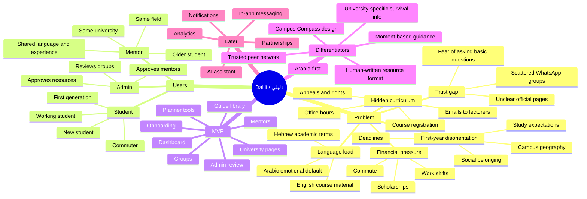

# Dalili Product Idea

## One-Sentence Product

Dalili is an Arabic-first campus compass that turns confusing university moments into clear steps, trusted people, and relevant resources.

## Product Narrative

A new Arab student enters university. The campus is not only new geographically. It is new linguistically, socially, administratively, and culturally. The student may understand the dream of higher education, but not the hidden operating system: how to register, what Hebrew terms mean, how to ask for help, where deadlines live, which office handles what, which WhatsApp group is reliable, when to contact a lecturer, how to understand scholarships, and whether confusion is normal.

Dalili should feel like an older student walking beside you and saying:

> "I know this moment. Here is what it means, here is what you do next, and here is who can help."

That is the difference between Dalili and a generic AI-built planner. The app is not built around features. It is built around moments of confusion.

## Who It Serves

Primary audience:

- Arab students entering Israeli universities and colleges.
- Preparatory year and first-year students.
- Students moving from Arabic school systems into Hebrew academic environments.
- First-generation students.
- Students who commute or work while studying.

Secondary audience:

- Older Arab students willing to mentor.
- Student associations and informal campus leaders.
- Admins who maintain trusted resources and approve mentors/groups.

Not the first audience:

- All Israeli students.
- International students.
- General productivity app users.
- Paid tutoring marketplaces.

## Mindmap

## North Star

Within two minutes, a new Arab student should find one practical answer that reduces confusion about university life.

Examples:

- "How do I write an email to a lecturer in Hebrew?"
- "Where do I find scholarships?"
- "What is Moodle?"
- "How do I know which courses to register for?"
- "Who from my university and field can explain this?"
- "Is there a first-year support group?"

## What Makes It Non-Generic

Dalili's uniqueness should come from product judgment, not from a large feature list.

Non-generic decisions:

- Arabic is the default voice, not a translation afterthought.
- Guides are written around real situations, not SEO article categories.
- Mentors are older students with lived context, not anonymous tutors.
- University pages explain practical navigation, not brochure content.
- The dashboard answers "what matters now?" instead of showing generic metrics.
- Hebrew terms are explained as survival vocabulary.
- Groups are moderated because trust matters.
- Content has sources and human review.

## Product Principles

### Be Specific

Do not say "academic support." Say "how to understand your first syllabus" or "what to do when Moodle shows no course."

### Reduce Shame

The product should make basic questions feel normal. It should never make students feel behind, ignorant, or weak.

### Connect Information To People

A resource is stronger when it ends with a mentor or group path.

### Use Arabic For Trust

Hebrew and English are necessary tools, but Arabic is the emotional and explanatory layer.

### Keep The MVP Human

Do not start with AI chat. Start with human-written guides, mentor profiles, and real workflows. AI can come later after the content model is strong.

## Success Criteria

The MVP is working if:

- A first-year student can complete onboarding without confusion.
- The dashboard recommends useful guides based on university, field, year, and help needs.
- A student can find a guide, understand the issue, and take the next action.
- A student can find at least one relevant mentor or group.
- Admins can keep public content trustworthy.
- The product feels made by people who understand the Arab student experience.

