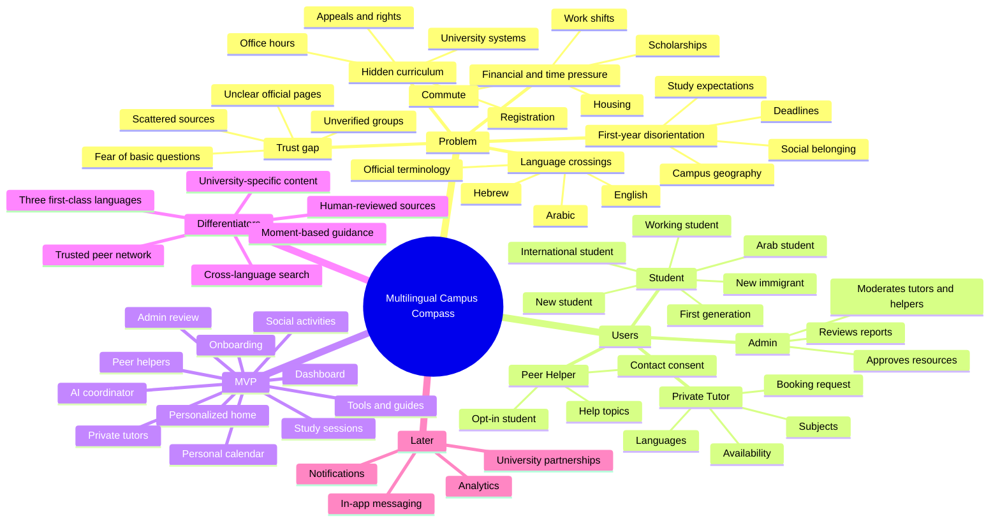

# Original Product Idea (Dalili, Now Elysium)

The current canonical definition is [Elysium Product Definition](elysium-product-definition.md). This document preserves the campus-guidance and multilingual reasoning that remains one part of the broader hub.

## One-Sentence Product

Elysium is a personalized, trilingual student hub for planning university life, meeting people, studying together, finding academic help, and knowing what to do next.

## Product Narrative

A student enters university and discovers that student life is fragmented: unfamiliar portals, course rules, deadlines, calendars, WhatsApp groups, social activities, study sessions, tutors, tools, scholarships, and expectations nobody clearly explains.

The exact difficulty differs by student. An Arab student may cross from Arabic-language schooling into Hebrew instruction and English readings. A new immigrant may understand the course but not campus bureaucracy. An international student may study in English and still need Hebrew for daily life. A Hebrew-speaking student may struggle with English academic sources, finances, commuting, or being the first person in the family to attend university.

The product should feel like a student-life home base saying:

> "Here is your week, the people and tools that can help, and the next useful action."

That is the difference between this product and a generic AI-built planner. Its modules are organized around connected student-life moments rather than an unrelated feature checklist.

## Who It Serves

Primary audience:

- Students in Israeli universities and colleges.
- Preparatory-year, first-year, and transition-stage students.
- Students who study or navigate campus in English, Hebrew, or Arabic.
- First-generation, working, commuting, new immigrant, and international students.
- Students who need a clear next action more than another productivity dashboard.

Priority research and launch segments:

- Arab students entering Hebrew-dominant academic environments.
- New immigrants and international students.
- Students with high financial, commute, language, or belonging friction.

Supporting users:

- Students hosting social activities or study sessions.
- Private tutors offering subject instruction.
- Students opting into Peer Helper profiles.
- Student associations and informal campus leaders.
- Admins who maintain trusted resources and moderate public listings.

Not the first audience:

- School pupils.
- University staff workflow systems.
- General productivity app users with no campus context.

## Mindmap

## North Star

Within two minutes, a student should complete one useful action that improves their academic or social week in the language they understand best.

Examples:

- "How do I write an email to a lecturer?"
- "What does this Hebrew administrative term mean?"
- "How do I understand this English syllabus term?"
- "Where do I find scholarships?"
- "Which office handles this problem?"
- "Who from my university and field can explain this?"
- "Is there a first-year or course support group?"
- "Who is studying this course today?"
- "Is anyone playing football on campus this evening?"
- "What deadline or session should I focus on next?"

## What Makes It Non-Generic

The product's uniqueness should come from product judgment, not from a large feature list.

Non-generic decisions:

- English, Hebrew, and Arabic are complete experiences, not a primary language plus partial translations.
- Search understands equivalent terms across the three languages.
- Guides are written around real situations, not SEO article categories.
- Official terms remain visible while explanations follow the student's preferred language.
- Private Tutors and Peer Helpers are separate roles with different expectations and consent models.
- Social activities, study sessions, deadlines, tutor requests, and recommendations share one student context.
- GPA tools, flashcards, helpful links, and guides remain part of the one-stop-shop promise.
- AI coordinates the hub instead of replacing it with chat.
- University pages explain practical navigation, not brochure content.
- The dashboard answers "what matters now?" instead of showing generic metrics.
- Groups are moderated because trust matters.
- Content has sources, dates, and human review.

## Language Model

- Ask for preferred interface language on first entry.
- Allow language changes at any time without losing position or data.
- Store one content concept with linked English, Hebrew, and Arabic versions.
- Keep official names and terms in their original language alongside explanations.
- Search across transliterations, abbreviations, and equivalent terms.
- Support full RTL for Arabic and Hebrew and full LTR for English.
- Never limit resources or people because of the chosen interface language.

## Product Principles

### Be Universal In Access, Specific In Help

Serve every student, but personalize by actual context rather than serving everyone the same generic dashboard.

### Reduce Shame

Make basic questions feel normal. Never imply that confusion means a student is weak or behind.

### Connect Information To People

A resource is stronger when it connects to a relevant activity, study session, tutor, Peer Helper, tool, office, or contact path.

### Treat Language As Context

Language affects comprehension and access, but it is not a proxy for identity or ability.

### Keep The MVP Human

Start with working social, study, calendar, tutor, Peer Helper, tools, and guide workflows. AI can connect and explain those workflows; it should not invent university policy or take actions without confirmation.

## Brand Direction

The product should feel primarily like a **Sage**: precise, calm, and knowledgeable. It should also carry a **Caregiver** quality: supportive and human without becoming sentimental.

The current product name is `Elysium`; `Dalili` remains in repository history as the original concept. See [Naming Directions](naming-directions.md) for the earlier naming work.

## Success Criteria

The MVP is working if:

- A student can complete onboarding in any supported language.
- The dashboard summarizes deadlines, joined items, and useful recommendations based on institution, field, year, courses, interests, languages, and help needs.
- A student can create or join social and study sessions and see them in the calendar.
- A student can add and manage personal deadlines.
- A student can distinguish Private Tutors from opted-in Peer Helpers and use each appropriately.
- GPA and flashcard tools complete their core workflows correctly.
- Elysium AI can coordinate the student's current context without inventing data or acting without confirmation.
- A student can find a guide through English, Hebrew, or Arabic search terms.
- A guide explains the official terminology and provides a concrete next action.
- A student can find at least one relevant activity, study session, tutor, Peer Helper, tool, guide, or official contact.
- Admins can keep public content sourced, current, and consistent across languages.
- Arab students and other high-friction segments report that the broader product still reflects their needs rather than erasing them.
