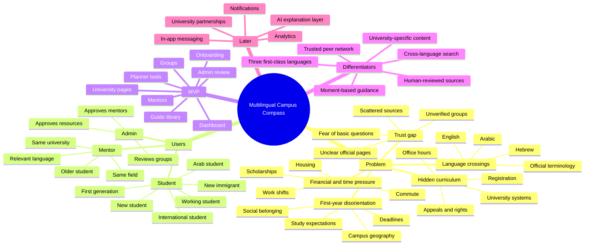

# Product Idea (Working Title: Dalili)

## One-Sentence Product

The product is a multilingual campus compass that turns confusing university moments into clear steps, trusted people, and relevant resources in English, Hebrew, and Arabic.

## Product Narrative

A student enters university and discovers a hidden operating system: unfamiliar portals, course registration rules, academic vocabulary, office responsibilities, deadlines, appeals, scholarships, lecturers, social groups, and expectations nobody clearly explains.

The exact difficulty differs by student. An Arab student may cross from Arabic-language schooling into Hebrew instruction and English readings. A new immigrant may understand the course but not campus bureaucracy. An international student may study in English and still need Hebrew for daily life. A Hebrew-speaking student may struggle with English academic sources, finances, commuting, or being the first person in the family to attend university.

The product should feel like an experienced student walking beside you and saying:

> "I know this moment. Here is what it means in your language, what to do next, and who can help."

That is the difference between this product and a generic AI-built planner. It is not organized around features. It is organized around moments of confusion.

## Who It Serves

Primary audience:

- Students in Israeli universities and colleges.
- Preparatory-year, first-year, and transition-stage students.
- Students who study or navigate campus in English, Hebrew, or Arabic.
- First-generation, working, commuting, new immigrant, and international students.
- Students who need a clear next action more than another productivity dashboard.

Priority research and launch segments:

- Arab students entering Hebrew-dominant academic environments.
- New immigrants and international students.
- Students with high financial, commute, language, or belonging friction.

Supporting users:

- Older students willing to mentor.
- Student associations and informal campus leaders.
- Admins who maintain trusted resources and approve mentors and groups.

Not the first audience:

- School pupils.
- Paid tutoring marketplaces.
- University staff workflow systems.
- General productivity app users with no campus context.

## Mindmap

## North Star

Within two minutes, a student should find one practical answer that reduces confusion about university life in the language they understand best.

Examples:

- "How do I write an email to a lecturer?"
- "What does this Hebrew administrative term mean?"
- "How do I understand this English syllabus term?"
- "Where do I find scholarships?"
- "Which office handles this problem?"
- "Who from my university and field can explain this?"
- "Is there a first-year or course support group?"

## What Makes It Non-Generic

The product's uniqueness should come from product judgment, not from a large feature list.

Non-generic decisions:

- English, Hebrew, and Arabic are complete experiences, not a primary language plus partial translations.
- Search understands equivalent terms across the three languages.
- Guides are written around real situations, not SEO article categories.
- Official terms remain visible while explanations follow the student's preferred language.
- Mentors are experienced students with relevant context, not anonymous rated tutors.
- University pages explain practical navigation, not brochure content.
- The dashboard answers "what matters now?" instead of showing generic metrics.
- Groups are moderated because trust matters.
- Content has sources, dates, and human review.

## Language Model

- Ask for preferred interface language on first entry.
- Allow language changes at any time without losing position or data.
- Store one content concept with linked English, Hebrew, and Arabic versions.
- Keep official names and terms in their original language alongside explanations.
- Search across transliterations, abbreviations, and equivalent terms.
- Support full RTL for Arabic and Hebrew and full LTR for English.
- Never limit resources or people because of the chosen interface language.

## Product Principles

### Be Universal In Access, Specific In Help

Serve every student, but personalize by actual context rather than serving everyone the same generic dashboard.

### Reduce Shame

Make basic questions feel normal. Never imply that confusion means a student is weak or behind.

### Connect Information To People

A resource is stronger when it ends with a relevant mentor, group, office, or contact path.

### Treat Language As Context

Language affects comprehension and access, but it is not a proxy for identity or ability.

### Keep The MVP Human

Start with human-reviewed guides, mentor profiles, and real workflows. AI can later help retrieve and explain approved content; it should not invent university policy.

## Brand Direction

The product should feel primarily like a **Sage**: precise, calm, and knowledgeable. It should also carry a **Caregiver** quality: supportive and human without becoming sentimental.

The working title `Dalili` will remain in repository history until a new name is tested and selected. See [Naming Directions](naming-directions.md).

## Success Criteria

The MVP is working if:

- A student can complete onboarding in any supported language.
- The dashboard recommends useful guidance based on institution, field, year, language comfort, and help needs.
- A student can find a guide through English, Hebrew, or Arabic search terms.
- A guide explains the official terminology and provides a concrete next action.
- A student can find at least one relevant mentor, group, or official contact.
- Admins can keep public content sourced, current, and consistent across languages.
- Arab students and other high-friction segments report that the broader product still reflects their needs rather than erasing them.
