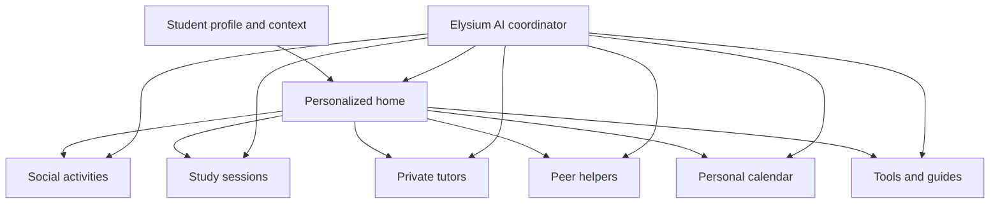

# Elysium Product Definition

This is the canonical product definition after the transition from Dalili to Elysium.

## Product Sentence

> Elysium is a personalized, trilingual student hub for planning university life, meeting people, studying together, finding academic help, and knowing what to do next.

## Core Idea

Elysium is a one-stop social and study companion. It is not only a guide library, calendar, social network, tutoring marketplace, or AI chat. Its value comes from connecting those needs around one student and one university context.

A student should be able to open Elysium and:

- See their deadlines, upcoming sessions, joined activities, and useful next actions.
- Post that they are going to play football and let students with the same interest join.
- Announce a library study session, course revision, or collaborative homework session.
- Find a private tutor for a subject and request or book a session.
- Find an opted-in student who is willing to answer peer questions.
- Add personal deadlines and plans to their calendar.
- Use GPA, grade-planning, flashcard, and other student tools.
- Open useful university links and source-backed guides.
- Ask Elysium AI what to do next or where to find the right feature, person, or resource.

## Product Model

The AI layer helps the student navigate and combine existing capabilities. It should not turn every feature into a chat interaction.

## Core Modules

### Personalized Home

The home screen answers two questions:

- What is happening in my student life?
- What should I do next?

It combines:

- Personal deadlines.
- Joined social activities.
- Upcoming study sessions.
- Tutor bookings or requests.
- Recommended activities, groups, tools, guides, or helpers.
- One AI-generated next-action summary based on real Elysium data.

The home screen should never become an empty calendar. When a student has no events, it should recommend a useful action.

### Social Activities

Students can create lightweight activity posts such as:

- Football, basketball, running, or gym sessions.
- Gaming, music, film, or hobby meetups.
- Lunch, coffee, campus events, or informal gatherings.

Each activity includes:

- Title and category.
- Date, time, and place.
- University/campus.
- Capacity when relevant.
- Host.
- Short description.
- Join/leave action.
- Participant count and approved visibility rules.

This module exists to reduce the friction of finding people with shared interests, especially for new or commuting students.

### Study Sessions

Students can create or join academic collaboration sessions such as:

- Quiet library study.
- Studying a specific course or subject.
- Solving homework together.
- Exam preparation.
- A recurring study group.

Each session includes:

- Course or subject.
- Session type.
- Date, time, and location or online link.
- Preferred language or languages.
- Collaboration expectations.
- Capacity.
- Host and participants.
- Join/leave action.

Study sessions must be separate from social activities in the data model and creation flow because students need different details and expectations.

### Private Tutors

Private tutors offer subject instruction. A tutor may be a student, graduate, or other approved provider.

Tutor profiles include:

- Subjects and courses taught.
- University and faculty familiarity.
- Teaching languages.
- Bio and experience.
- Price or "contact for price" if pricing is enabled.
- Availability.
- Online/in-person options.
- Contact or booking-request method.
- Moderation and report status.

The MVP can use a booking request instead of a full scheduling and payment system. Reviews may exist, but fake or unverified ratings must never be seeded as real user evidence.

### Peer Helpers

Peer Helpers are students who voluntarily agree to answer student-life or academic-navigation questions. They are not the same as private tutors.

A student enables Peer Helper status from their profile and explicitly consents to the information that will be public.

Peer Helper profiles include:

- University, faculty, field, and year.
- Languages.
- Topics they can help with.
- Short bio.
- Contact preference.
- Availability indicator.
- Consent status and ability to disable visibility immediately.

Peer Helpers can assist with registration experience, first-year questions, campus navigation, course selection experience, student systems, or social integration. They should not be presented as official university authorities.

### Personal Calendar

Every student has a calendar that combines:

- Personal deadlines and reminders.
- Joined social activities.
- Joined study sessions.
- Tutor bookings or requests.
- Relevant university deadlines when available.

Students can add, edit, complete, and delete their own items. Joined Elysium activities appear automatically, but leaving an activity removes or updates the related calendar entry.

The calendar is a core personalization surface, but the home screen should summarize it instead of opening with an empty calendar grid.

### Tools And Guides

Tools remain part of the one-stop-shop promise.

Initial tools:

- GPA calculator.
- Required-grade calculator.
- Flashcard decks.
- Semester progress or course tracker.
- Email templates.
- Academic term glossary.
- Helpful university links.
- Source-backed student guides.

Tools should be organized by student need and should preserve data where useful. They do not all need equal prominence on the home screen.

### Elysium AI

AI is a connective assistant across the hub.

Useful responsibilities:

- Summarize what is next from the student's calendar and joined items.
- Recommend a relevant social activity or study session.
- Help the student find a tutor or peer helper using existing filters.
- Route a question to a tool, guide, helpful link, or university office.
- Explain approved guide content in English, Hebrew, or Arabic.
- Help draft a personal deadline or study plan for the student's approval.

Boundaries:

- It does not invent university policy.
- It does not silently create bookings, calendar events, or public posts.
- It asks for confirmation before taking an action.
- It does not expose another user's private data or contact information beyond their consent.
- It should admit when Elysium does not have a trustworthy answer.

## Personalization Inputs

Personalization can use:

- University and campus.
- Faculty, field, and courses.
- Academic year.
- Preferred interface language.
- Languages used for study and conversation.
- Interests and hobbies.
- Help needs.
- Calendar and joined activity context.
- Tutor/helper preferences.
- Optional commute or housing context.

Students control optional attributes and can edit them later.

## Roles

### Student

- Uses the hub.
- Creates and joins activities and study sessions.
- Manages a personal calendar.
- Finds tutors and peer helpers.
- Uses tools, guides, links, and AI.

### Activity Or Session Host

- Is still a student role.
- Creates and manages their own activity or study session.
- Can communicate essential changes to participants.

### Private Tutor

- Opts into a tutor profile.
- Publishes subjects, languages, availability, and contact/booking details.
- Responds to booking requests.

### Peer Helper

- Opts into a helper profile.
- Chooses topics, languages, and public contact preference.
- Can disable or update visibility at any time.

### Admin

- Moderates reports and public listings.
- Manages trusted guides and helpful links.
- Reviews tutor/helper abuse or impersonation.
- Does not read private student information without a defined operational reason and permission.

One user may hold student, tutor, and peer-helper capabilities simultaneously.

## Connected User Journeys

### Social Journey

1. A student sees a football activity relevant to their campus and interests.
2. They join it.
3. It appears in their calendar and home summary.
4. Elysium reminds them and suggests what they need to know.

### Study Journey

1. A student asks for help preparing for a CS exam.
2. Elysium shows a nearby study session, a matching tutor, flashcards, and the exam deadline.
3. The student joins the session and saves the deadline.
4. Both appear in the personalized home and calendar.

### Peer Help Journey

1. A student has a question about first-year registration.
2. Elysium shows a sourced guide and matching opted-in peer helpers.
3. The student chooses the guide or contacts a helper through the permitted method.

These connections are the product's differentiation. Each module becomes more useful because it updates the same student context.

## Product Principles

- **One hub, not one giant screen:** modules are connected but remain understandable.
- **Personalization must produce action:** recommendations should explain why they are relevant.
- **Social discovery must feel safe:** clear hosts, report tools, visibility controls, and consent.
- **Human roles must be explicit:** tutor, peer helper, participant, and official contact are not interchangeable.
- **AI coordinates, humans decide:** consequential actions require confirmation.
- **Three real languages:** English, Hebrew, and Arabic have equivalent core workflows.
- **Never fake activity:** seed demo content transparently and report real traction separately.

## Hackathon Promise

The hackathon version should prove that the hub is connected, not merely show many menu items.

The demonstration should show:

1. A personalized home with a real next action.
2. Joining one social activity.
3. Joining or creating one study session.
4. Seeing both appear in the personal calendar.
5. Finding a private tutor and a separate peer helper.
6. Using one student tool.
7. Asking Elysium AI what to do next and receiving a useful, data-grounded answer.
